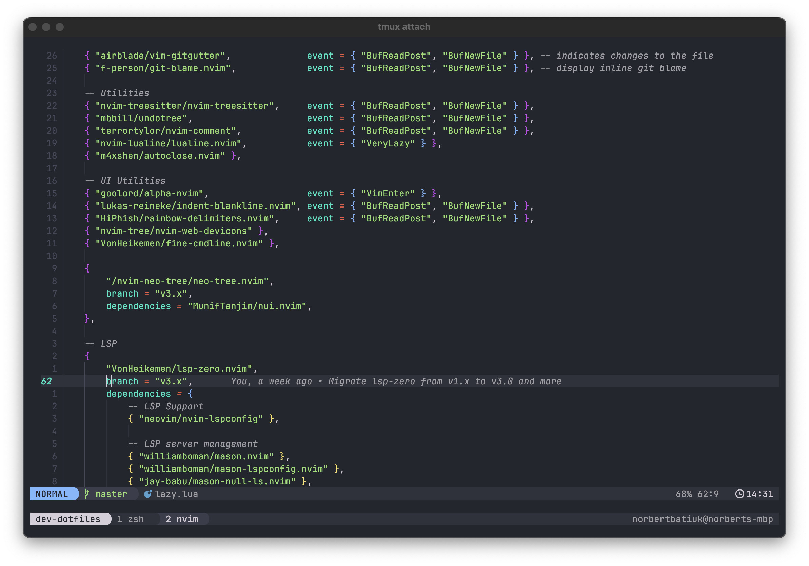

Oh, are you also in looking for neovim port of [Andromeda Theme for VS Code](https://github.com/EliverLara/Andromeda/tree/master)? Well, look no further!

<p align="center">

</p>

# Andromeda Theme for Neovim

True neovim-adaption of [Andromeda Theme for VS Code](https://github.com/EliverLara/Andromeda/tree/master)!

Built on [nvim-noirbuddy](https://github.com/jesseleite/nvim-noirbuddy) and [colorbuddy.nvim](https://github.com/tjdevries/colorbuddy.nvim), with my personal touch.



[](github-release)
[](github-last-commit)
[](githut-commits-since)

## Table of Content

-   [Installation](#installation)
-   [Supported plugins](#supported-plugins-as-of-right-now)
-   [Customization](#customization)
    -   [Customizing background(s)](#customizing-backgrounds)
    -   [Customizing accent color(s)](#customizing-accent-colors)
    -   [Customazing font style(s)](#customizing-font-styles)
-   [Thank You](#thank-you)

## Installation

1. Install using your favourite package manager:

    > **\*Note:** You'll need to use colorbuddy's `dev` branch for now, but that'll change to `master` in time...\*

    **Using [packer.nvim](https://github.com/wbthomason/packer.nvim):**

    ```lua
    use {
      "nobbmaestro/nvim-andromeda",
      requires = { "tjdevries/colorbuddy.nvim", branch = "dev" }
    }
    ```

    **Using [vim-plug](https://github.com/junegunn/vim-plug):**

    ```vim
    Plug 'tjdevries/colorbuddy.nvim', { 'branch': 'dev' }
    Plug 'nobbmaestro/nvim-andromeda'
    ```

2. Enable the colorscheme in your lua config:

    ```lua
    require("andromeda").setup()
    ```

3. Stop procrastinating and go back to coding!

## Supported plugins (as of right now)

-   [flash.nvim](https://github.com/folke/flash.nvim/tree/8a8e74922a383c253b7f92e042b749150140c8d1)
-   [fugitive.vim](https://github.com/tpope/vim-fugitive)
-   [harpoon](https://github.com/ThePrimeagen/harpoon)
-   [lazy.nvim](https://github.com/folke/lazy.nvim)
-   [lualine.nvim](https://github.com/nvim-lualine/lualine.nvim)
-   [mason.nvim](https://github.com/williamboman/mason.nvim)
-   [rainbow-delimiters.nvim](https://github.com/HiPhish/rainbow-delimiters.nvim)
-   [telescope.nvim](https://github.com/nvim-telescope/telescope.nvim)
-   [vim-gitgutter](https://github.com/airblade/vim-gitgutter)
-   [vim-signify](https://github.com/mhinz/vim-signify)

Note, in order to set up lualine, one has to modify lualine config accordingly:

```lua
local andromeda_lualine = require("andromeda.plugins.lualine")

require("lualine").setup({
    options = {
        theme = andromeda_lualine.theme,
    },
    sections = andromeda_lualine.sections,
    inactive_sections = andromeda_lualine.inactive_sections,
})

```

## Customization

Currently supported customizations are listed below.

### Customizing background(s)

To change the background and/or highlighting, override following variables in the configuration:

```lua
require("andromeda").setup({
    preset = "andromeda",
    colors = {
        background = "#23262e",
        mono_1     = "#2f323c", -- secondary background and/or highlighting
        mono_2     = "#3a3e4b", -- used for highlighting
        mono_3     = "#464959", -- used for highlighting
        mono_4     = "#a0a1a7", -- comments
        mono_5     = "#d5ced9", -- normal text
    }
})
```

For transparent background, set following flag:

```lua
require("andromeda").setup({
    preset = "andromeda",
    transparent_bg = true,
})
```

### Customizing accent color(s)

As of right now, I have selected the `primary` as the most dominant accent color. Whereas the usage of `secondary` color is almost non-existent. Regardless, these can be overriden, accordingly:

```lua
require("andromeda").setup({
    preset = "andromeda",
    colors = {
        primary   = "#00e8c6", -- defaults to cyan
        secondary = "#ff00aa", -- defaults to pink
    },
})
```

### Customizing font style(s)

In order to enable "Andromeda Italic", add following to the configuration:

```lua
require("andromeda").setup({
    preset = "andromeda",
    styles = {
        italic = true,
    }
})
```

## Thank You

-   [Jesse Leite](https://twitter.com/jesseleite85) for your amazing work on [nvim-noirbuddy](https://github.com/jesseleite/nvim-noirbuddy). Your repo is what kick-started this very project.

-   [TJ DeVries](https://twitter.com/teej_dv) for your incredible work on [colorbuddy.nvim](https://github.com/tjdevries/colorbuddy.nvim). Truly amazing work!
